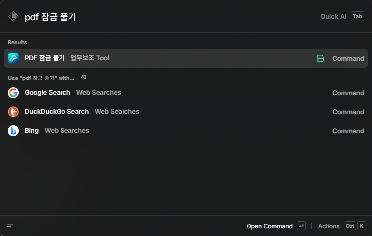
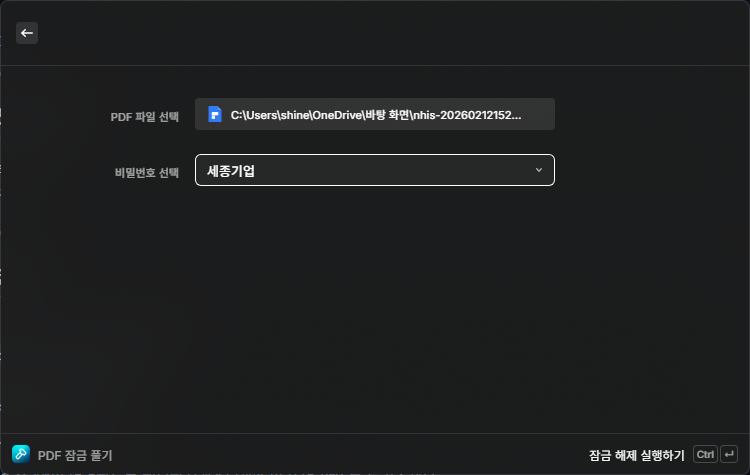
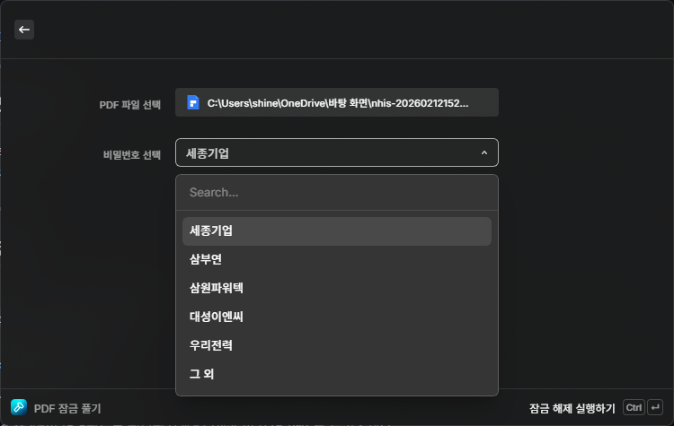
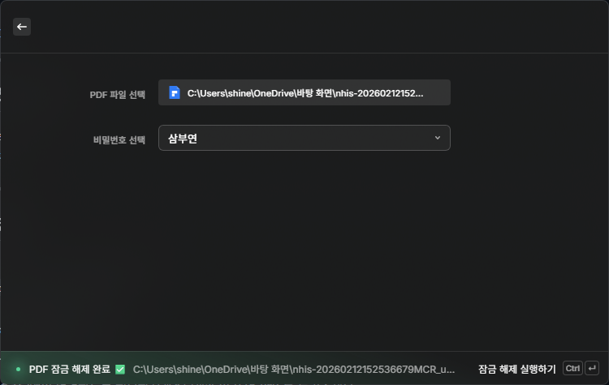
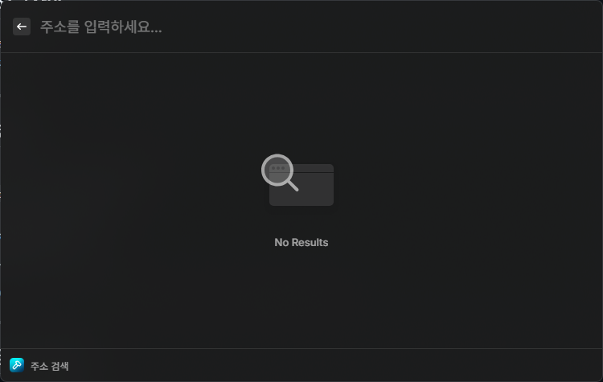
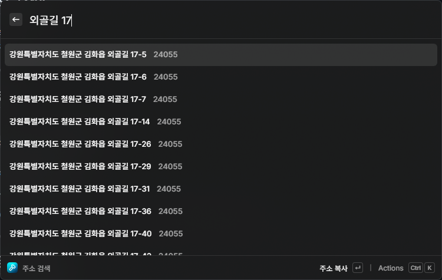
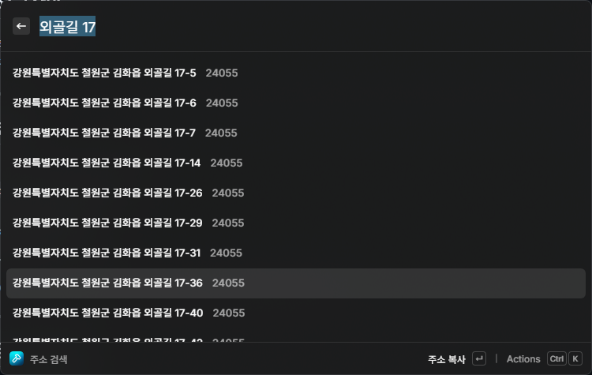

# 🛠 업무보조 Tool — Raycast Extension (Windows)

업무에 필요한 다양한 기능을 제공하는 Raycast Extension입니다.

---

## 📋 목차

1. [사전 요구사항](#-사전-요구사항)
2. [설치 방법](#-설치-방법)
3. [기능 및 사용 방법](#-기능-및-사용-방법)
   - [PDF 잠금 풀기](#-pdf-잠금-풀기)
   - [주소 검색](#-주소-검색)
4. [문제 해결](#-문제-해결)
5. [프로젝트 구조](#-프로젝트-구조)

---

## 💻 사전 요구사항

- Windows 10 이상
- 인터넷 연결

---

## 🚀 설치 방법

1. 이 페이지 우측 상단 **`<> Code`** 버튼 클릭
2. **`Download ZIP`** 클릭 후 압축 해제
3. 폴더 안의 **`setup.bat`** 을 우클릭
4. **관리자 권한으로 실행** 선택
5. 설치가 완료될 때까지 안내에 따라 진행합니다

> 설치 중 **Raycast 다운로드 페이지**가 브라우저에서 자동으로 열립니다.
> 다운로드 후 설치를 완료하고 Enter 키를 눌러 계속 진행하세요.


---

## 📖 기능 및 사용 방법

### Raycast 실행 방법

> 키보드에서 `Alt + Space` 를 누르면 Raycast가 실행됩니다.

---

### 🔓 PDF 잠금 풀기

비밀번호가 걸린 PDF 파일의 잠금을 해제합니다.
잠금이 해제된 파일은 원본 파일과 같은 폴더에 `파일명_unlocked.pdf` 로 저장됩니다.

#### 실행 방법

1. `Alt + Space` 로 Raycast 실행
2. `PDF 잠금 풀기` 입력 후 `Enter`

   

3. **PDF 파일 선택** 버튼 클릭 후 잠금 해제할 PDF 파일 선택

   

4. **비밀번호 선택** 드롭다운에서 해당 비밀번호 선택
   - 목록에 없는 경우 **그 외** 선택 후 직접 입력

   

5. `Ctrl + Enter` 로 실행
6. 완료 메시지가 뜨면 성공입니다 ✅

   

---

### 🔍 주소 검색

대한민국 도로명 주소를 검색하고 클립보드에 복사합니다.

#### 실행 방법

1. `Alt + Space` 로 Raycast 실행
2. `주소 검색` 입력 후 `Enter`

   

3. 검색창에 주소 키워드 입력
   - 예시: `외골길 17-5, 삼부연로`

   

4. 검색 결과에서 원하는 주소 선택 후 `Enter`

   

5. 클립보드에 자동으로 복사됩니다 ✅

#### 복사 옵션

검색 결과에서 `Ctrl + K` 를 누르면 복사 방식을 선택할 수 있습니다.

| 옵션 | 복사 내용 | 예시 |
|------|----------|------|
| 주소 복사 | 도로명 주소 + 우편번호 | 판교역로 235 (13494) |
| 도로명 주소만 복사 | 도로명 주소만 | 판교역로 235 |
| 우편번호만 복사 | 우편번호만 | 13494 |

---

## 🛠 문제 해결

### Raycast에서 커맨드가 보이지 않는 경우

프로젝트 폴더에서 아래 명령어를 실행하세요.

```powershell
npm run dev
```

---

### `node` 또는 `npm` 이 인식되지 않는 경우

```powershell
Set-ExecutionPolicy RemoteSigned -Scope CurrentUser
```

PowerShell 재시작 후 다시 확인하세요.

---

### `qpdf` 이 인식되지 않는 경우

```powershell
where.exe qpdf
```

경로가 출력되지 않으면 `setup.bat` 을 다시 실행하세요.

---

### `npm install` 실패하는 경우

```powershell
npm cache clean --force
npm install
```

---

### PDF Unlock 실패하는 경우

- 비밀번호가 올바른지 확인하세요.
- PDF 파일 경로에 한글이나 특수문자가 포함된 경우 오류가 발생할 수 있습니다.
- 파일이 이미 열려 있는 경우 닫은 후 다시 시도하세요.

---

### 주소 검색 결과가 나오지 않는 경우

- 인터넷 연결 상태를 확인하세요.
- 검색어를 더 구체적으로 입력해보세요.

---

## 📁 프로젝트 구조

```
work-tools/
├─ src/
│  ├─ unlock-pdf.tsx        # PDF 잠금 해제
│  ├─ address-search.tsx    # 주소 검색
│  └─ data/
│     └─ passwords.json     # 비밀번호 설정 파일
├─ assets/                  # README 스크린샷 폴더
├─ package.json
├─ tsconfig.json
├─ setup.bat
└─ README.md
```
